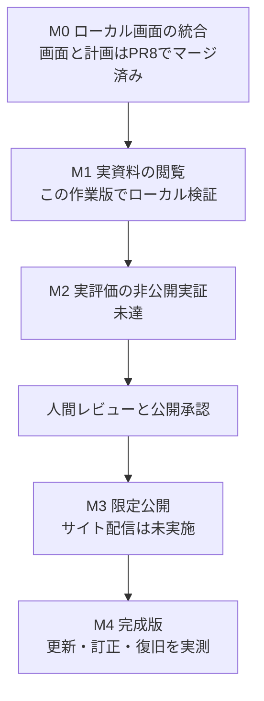

# 国賊ランキング / 国士ランキング

日本の長期的な経済・技術の伸び悩みについて、政策の実施・結果と人物・団体の関与を根拠から調べるサイトです。ローカルでは長期統計、公式議案本文、投票記録を閲覧できます。実在人物の採点と公開版は未成立です。

| はじめに知りたいこと | 入口 |
|---|---|
| 何を調べるサイトか | [目的](#目的) |
| 今動くものは何か | [できること](#できること) |
| 手元で試す | [クイックスタート](#クイックスタート) |
| 何がまだできないか | [制約と未実施の範囲](#制約と未実施の範囲) |
| データと公開範囲 | [データの保存・配布方針](data/README.md) |
| 完成までの道筋 | [ロードマップ](#ロードマップ) |

## ロードマップ

| 段階 | 次に確かめる成果 |
|---|---|
| 資料・成果の統合 | 取得済み資料、公開済み成果、未解析・未取得を区別します |
| 実資料閲覧 | 政策内容・行動・引用・原資料をページ内で読めます |
| 実評価 | 1施策と複数人物を根拠付きで評価し、訂正再計算を確認します |
| 国際比較 | 同じ条件で日本と他国の政策・結果・遅れを比較します |
| 限定公開 | 内容・権利・訂正窓口をレビューした版を配信します |
| 継続運用 | 宣言した調査範囲で更新・訂正・障害復旧を再現します |

国際比較と実評価は未成立です。必要な不足根拠だけを掘り下げ、資料件数や画面の完成を、因果評価やサービス全体の完成へ読み替えません。

## 目的

政治・制度情報を判断したい一般市民が、評価の理由と未確認の範囲を自分で確認できる道具を目指しています。経済成長・科学技術への貢献と悪影響を別々に比較し、行動記録と政策影響の分析を分離します。

歴史調査には当時の政治家・行政機関・団体を含めます。直近3回の国政選挙の候補者は、選挙向けの絞り込みとして扱います。製品名は人格や法的な「国賊」認定を意味しません。

目的・責務・評価方法の正本は [`PROJECT_SSOT.md`](PROJECT_SSOT.md) です。

## できること

| ローカルの入口 | 読める内容 |
|---|---|
| `/history`（通常のトップ） | 実質・名目`GDP`、人口、一人当たり実質`GDP`。40・30・8・4・2年と任意範囲。ローカル原本が無いときは公開配布版 |
| `/policies` | 公開事例の実施・観測・比較・不足資料。保存済みの国会評価版はローカル接続時だけ |
| `/actors` | 公開事例に出てくる人物・機関。採点しない。名簿だけでは加点しない |
| `/evaluation` | 非公開の保存評価版。この配布物には入っていない |
| `/ranking` | 架空データによる貢献・悪影響の操作デモ |


現在は、世界銀行の公開系列と、金融庁が公表した「金融再生プログラム」の一事例を、点数なしで読めます。不良債権比率の前後は公式発表として示しますが、`GDP`への寄与も人物の点数も未確立です。ローカルの非公開原本は、このリポジトリには入っていません。

現在の最小実用試作版（`MVP`）は、架空データの比較画面と、未検証の実資料を分離して読むローカル画面です。ソースの公開と、実在評価を配信するサイトの公開は別工程です。

| 見たいこと | 操作 | 読み取る範囲 |
|---|---|---|
| 同じ条件で比較する | 分野・期間・貢献／悪影響を選ぶ | 経済・技術の架空の点数 |
| 順位の理由を調べる | 人物と政策を選ぶ | 提出・採決などの行動と内訳 |
| 根拠や留保を確認する | 行動ごとの資料を選ぶ | 出典、反証、未評価と取得範囲 |


この図は読み進め方であり、人物・政策間の因果関係や責任の強さを示すものではありません。

- 架空データの経済・技術について、貢献／悪影響と直近2・4・8年／累積を切り替える。
- 人物の順位から、提出・採決などの行動、政策評価、反証、資料へたどる。
- 検索・議院・役職区分で絞り込み、比較条件を`URL`で復元する。
- 限定取得した公式資料の処理結果をローカルファイルから開き、取得範囲と保留理由を確認する。

最初は「分野・期間・貢献／悪影響」を選び、人物を選択してください。総合重みなどの補助設定は「詳細設定」にあります。財政・安全保障・統治と公約・見込みは未評価として表示します。

悪影響を選ぶとダーク基調の「国賊ランキング」、貢献を選ぶと白基調の「国士ランキング」に切り替わります。政策から個々の行動と資料へ進める二次元の関係図を使い、選択状態は再読込や戻る操作でも復元できます。

人物ごとに貢献点と悪影響点を並べ、同じ分野・期間での傾向を表示します。片側が未評価なら、その状態を残します。ツリーは現在の条件に連動し、「全履歴」で条件外の行動も確認できます。[画面遷移図](docs/visual-resource-selection.md)も参照できます。

## 完成版への道筋

完成版`v1`の目標は、経済・科学技術の実データを`Sites`で公開し、更新・訂正・復旧まで運用することです。対象は衆参それぞれ直近3回の選挙の立候補者（落選者・期間内の補選を含む）。未評価を残し、全員への強制採点はしません。



矢印は受入条件の順序です。この作業版は`M1`の実資料閲覧基盤を含みますが、遠隔反映・マージ済みではありません。限定入力は2026-07-10の参院6会議、保存原本3件・発言397件・投票247件・選定政策2件です。投票資料があるのは53号の1政策で、41号は入力ファイルにありません。発言397件と政策の対応は不明、人物同定・確認済み行動・実在採点は各0件です。各段階の受入条件と到達状態は[ロードマップの正本](PROJECT_SSOT.md#段階的な達成条件)、最新検証と残務は[運用手順](docs/operations.md)にまとめています。

## クイックスタート

入手先は[このリポジトリ](https://github.com/nexus-ai-2045/public-interest-lens)です。`AI`アシスタントに準備を頼む場合は、このリンクと次の範囲を渡してください。

> ローカルの架空データ画面の起動まで。先に危険レビューを出してください。削除・外部書込み（`write`）・公開範囲変更（`visibility`）・秘密情報（`secret`）・未確認（`unknown`）を安全とみなさず、公開・外部送信・設定変更は行わないでください。

必要なものは`Node.js` 22以上と`npm`です。リポジトリ直下から次を実行します。

```powershell
cd app
npm ci
npm run dev
```

ブラウザで `http://127.0.0.1:5173` を開きます。架空データ画面だけを見る場合、外部サービスへのログインや認証情報は不要です。終了は実行した端末で`Ctrl+C`を押してください。

公式資料の限定取得には`Python` 3.12以上も必要です。[運用手順](docs/operations.md)の既存コマンドを使ってください。「ローカル評価データ`JSON`を開く」で選んだファイルはブラウザ内で読み、架空の順位へ混ぜたり外部へ送信したりしません。

## 制約と未実施の範囲

- 実在人物の採点、候補者全員の収録、過去40〜50年の全量取得、常時自動更新は未実施です。
- 実資料の限定取得では、影響の根拠が不足する議案を保留します。取得できたことを採点可能と読み替えません。
- 所属・訪問・発言だけでは実績点を付けず、党の方針から個人の賛否を補完しません。
- 点数は製品上の仮定による複合指標です。因果確率、経済損失額、唯一の客観的順位ではありません。
- 実在人物の評価とサイト公開には、出典・反証・訂正手順を含む別の人間レビューが必要です。

原資料と取得結果は`.local/`に保管し、`Git`やサイト配信物に含めません。コードの[ライセンス](LICENSE)（`MIT`）は、外部資料の転載を許可するものではありません。

## 開発時の検証

画面の検証は`app/`で実行します。

```powershell
npm test
npm run build
npm audit --audit-level=moderate
npx playwright install chromium
npm run test:e2e
```

収集・資料登録の検証はリポジトリ直下で実行します。

```powershell
python -m unittest discover -s tests -v
```

ローカルテストの成功、`GitHub`上の検証、人間レビューは別の結果です。最新の確認範囲と未完了事項は[運用手順](docs/operations.md)を参照してください。

## 正本と運用

- [仕様カード](spec-card.md): 入出力・算定の境界。
- [画面と視覚表現](docs/visual-resource-selection.md): 比較から根拠へ進む流れと既存ツールの使い分け。
- [運用手順](docs/operations.md): スモーク・再開・失敗時対応・残務。
- [国会データの取得範囲](docs/diet-data-coverage.md): 公式ソースと取得状態。
- [`ADR` 0002](docs/adr/0002-person-ranking-and-evidence-boundary.md): 人物ランキングへの目的修正。
- [人間レビュー](human-review-checklist.md): 算定方法と実在データ公開の判断。
- [外部資料保存](docs/external-materials.md): 既存登録処理を使う。取得と真偽を分離。
- [貢献手順](CONTRIBUTING.md): 変更の範囲、テスト、資料の取扱い。
- [公開前検査](PREFLIGHT.md) / [公開対象と未確認事項](PUBLIC_READY.md): リポジトリ公開とアプリ公開を区別。
- [移行記録](MIGRATION.md) / [旧実行記録](run-card.md): 過去の由来。

旧称「公益レンズ」はリポジトリ識別子と過去記録に残しています。[セキュリティ方針](SECURITY.md)も確認してください。
