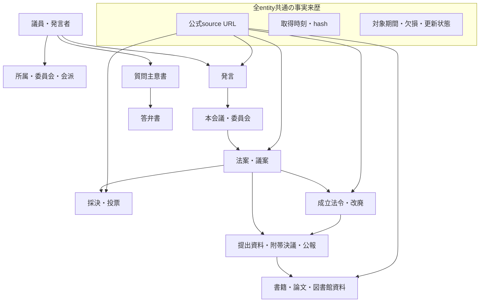
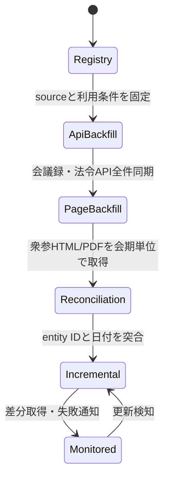

# 国会・法令・図書館データ取得範囲

## 目的

国賊／国士ランキングで、一般市民が政策・議員・制度を判断する際に、発言、審議、採決、法案、法令、質問主意書、関係資料、図書館資料を公式情報から相互参照できるようにします。

官報、国の予算・決算、行政事業レビュー、政治資金、議員資産の公開案内、公式候補者名簿も取得候補へ含めます。これらは取得元の計画定義で、本文取得や網羅の完了ではありません。政治家の公的活動を対象とし、第三者の住所・電話などを人物検索や評価へ投影しません。

参議院のライブラリーから議案・投票・質問・請願・議員・公報・会議録の索引を分け、索引の母集合、本文、添付、読める本文、未取得を別計数にします。検索結果の終端や未取得件数のゼロだけで全量完了とはせず、取得範囲の固定と独立した完全性照合を必要とします。取得不能な入口は失敗として残し、別入口の成功へ合流させません。

「全部取得」は、単一サイトの全ページ複製ではない。公式提供元ごとの公開範囲、開始回次、更新時刻、利用条件、欠損を記録し、取得可能な公式データ面を段階的に埋めることと定義する。

## 情報モデル



## 公式ソース面

| データ面 | 正本候補 | 取得方式 | 初期優先度 | 注意点 |
|---|---|---|---|---|
| 衆参の会議・発言 | 国立国会図書館「国会会議録検索システム」 | 公式検索`API` | `P0` | `API`登録範囲と更新遅延を別記する |
| 衆議院の議案・経過 | 衆議院「立法情報」 | `HTML/PDF`差分取得 | `P1` | 掲載開始回次が種類ごとに異なる |
| 衆議院の質問・答弁 | 衆議院「質問主意書・答弁書」 | `HTML/PDF`差分取得 | `P1` | 第1回国会以降を公式ページが案内 |
| 衆議院の委員会・公報 | 衆議院「本会議・委員会等」 | `HTML/PDF`差分取得 | `P2` | 公報・ニュース・委員名簿を分離する |
| 参議院の議案・投票 | 参議院「ライブラリー」 | `HTML/PDF`差分取得 | `P1` | 本会議投票結果と議案経過を結合する |
| 参議院の質問・決議・請願 | 参議院「ライブラリー」 | `HTML/PDF`差分取得 | `P2` | 種別ごとの識別子と会期を保持する |
| 法令本文・時点差分 | `e-Gov`法令`API` `Version` 2 | `OpenAPI` | `P1` | 法令`ID`、法令番号、`revision` `ID`を保持する |
| 法令沿革・法案審議経過 | 国立国会図書館「日本法令索引」 | 検索結果参照・差分取得 | `P2` | 明治19年以降の索引。本文正本とは分離する |
| 書籍・論文・所蔵 | 国立国会図書館サーチ | `SRU/OpenSearch/OAI-PMH` | `P2` | `API`提供許諾済み`metadata`だけが対象 |

機械可読の正本は[`data-sources/diet-official-sources.yaml`](../data-sources/diet-official-sources.yaml)とする。

## 取得段階



### `Phase` 0: `registry`と`schema`

- `source` `ID`、公式`URL`、取得方式、対象期間、利用条件確認先を固定する。
- `entity`ごとに`source_url`、`source_actor`、`event_time`、`observed_at`、`content_hash`を必須にする。
- 「公式サイトが述べている事実」と「その記述内容の真偽」を分離する。

### `Phase` 1: `API`全件同期

- 国会会議録`API`を会期・院・日付で`pagination`し、`meeting`と`speech`を保存する。
- `e-Gov`法令`API` `Version` 2から`law`と`revision`を保存する。
- `raw` `response`は`private` `object` `storage`、正規化`metadata`は`DB`、公開画面は引用に必要な最小範囲を使う。

### `Phase` 2: 衆参固有データ

- 会期を`watermark`にして議案、投票、質問、答弁、請願、決議、委員会資料を取得する。
- `HTML`と`PDF`を同一`document`としてまとめず、それぞれ`hash`と`URL`を保持する。
- 掲載開始回次より前は`not_available_from_source`とし、欠損と取得失敗を区別する。

### `Phase` 3: 図書館・研究資料

- `NDL`サーチの`SRU/OpenSearch`でテーマ・人物・法案に関連する書誌を検索する。
- 大量`metadata`連携が必要な場合だけ`OAI-PMH`と利用申請要否を確認する。
- 所蔵情報、書誌情報、本文閲覧可否を別フィールドにする。

### `Phase` 4: 継続更新

- 日次: 新規会議録、議案経過、投票、質問答弁。
- 週次: 委員名簿、会派、関連資料、リンク切れ。
- 月次: 全`source` `coverage`、重複、欠損、`schema` `drift`、利用条件。
- 過去データの訂正を検知できるよう、`URL`だけでなく`content` `hash`を比較する。

## 完了条件

「網羅取得済み」は次を全て満たす場合だけ使う。

- `registry`内の必須`source`が全て`ready`である。
- `source`ごとに開始・終了`watermark`と最終成功時刻がある。
- `pagination`の終了と再走査の安定が証明されている。
- `raw`件数、正規化件数、`entity` `ID`集合が一致する。
- 欠損が0、または理由付き`known_gap`として列挙されている。
- 利用条件、`robots`、`rate` `limit`、公開可否が確認されている。
- `source`更新後の`next-run` `smoke`が成功している。

現時点では取得器と限定スモークまでであり、国会全件取得済みではない。

## 2026-08-06 `API`スモーク実測

国立国会図書館「国会会議録検索システム`API`」へ、第一回から第999回を検索範囲として各1件だけ逐次問い合わせた。

| エンドポイント | `API`報告件数 | 今回保存 | 状態 |
|---|---:|---:|---|
| `meeting_list` | 115,014 | 1 | `partial` |
| `speech` | 11,243,069 | 1 | `partial` |

観測時刻はそれぞれ `2026-08-06T20:03:08+09:00`、`2026-08-06T20:03:16+09:00`。これは`API`が返した検索件数であり、重複除去後の固有会議数・固有発言数とは未照合である。全量取得済みではない。

## 会議録取得ランカード

取得器は直列実行、3秒間隔、チェックポイント再開を既定とする。実データは`Git`管理外の `.local/` に保存する。

```powershell
python scripts/fetch_diet_minutes.py meeting_list `
  --session-from 1 --session-to 999 `
  --output-dir .local/diet/minutes/meeting-list `
  --maximum-records 100 --max-pages 1

python scripts/fetch_diet_minutes.py speech `
  --session-from 1 --session-to 999 `
  --output-dir .local/diet/minutes/speech `
  --maximum-records 100 --max-pages 1
```

`speech` は現時点の`API`報告件数だけで約11.2百万件ある。100件/ページでも約112,431リクエストとなり、3秒待機だけで約94時間を要する計算のため、常時実行環境・容量見積り・停止監視を整えてから開始する。

## 2026-09-12 吸収・検証と再開契約

既存 `diet-data-foundation` 作業ツリーの取得器、テスト、公式ソース台帳、`ADR`、本書を吸収した。別の取得器を増やさず `scripts/fetch_diet_minutes.py` を継続する。原作業ツリーの未コミット変更は保持した。

- 公式`API`への逐次1リクエストで、第1回国会の発言を1件取得。`API`報告71,304件、次位置2、`status=capped`、`complete=false`。観測は2026-09-12`T18`:16:51+09:00。検索結果総数は網羅性の証明ではない。
- `.local/diet/smoke-20260912-fanin/manifest.json` にローカル実測を保存。本文・個人情報は`Git`へ追加しない。
- 再開は同じコマンド・同じ出力先で行う。`endpoint`、会期範囲の変更は別の出力先にする。`v1` `checkpoint`は自動信頼せず新しい出力先で再取得する。
- 3秒以上の逐次間隔、30秒タイムアウト、20 `MiB`上限、リダイレクト拒否を適用。`API`障害・重複`ID`・ページ位置不整合・総数変動は`failed`にする。`failed`は終了コード1、`capped`と`query_exhausted`は0なので運用側は`manifest`の`status`も確認する。
- 保存ページの`hash`を再開前に照合する。取得後は既存`register_external_material.py`へ登録し、`unverified`を保持する。保存表現は`JSON`の再シリアライズであり`HTTP`応答のバイト列そのものではない。
- `complete`は指定検索の終端だけを意味する。`corpus_complete`は常に`false`。採決・政策効果・個人責任の検証やランキングへの投入は別工程で、人間レビューを必要とする。
- 訂正で検索総数やページ構成が変わった場合、運用担当は新しい出力先で同一範囲を再取得して差分を照合する。全量実行、常駐スケジューラ、監視通知は未導入。容量・利用条件・停止方法の確認後に運用担当が開始する。

## 公式参照

- [国会会議録検索システム `API`](https://kokkai.ndl.go.jp/api.html)
- [衆議院 立法情報](https://www.shugiin.go.jp/Internet/index.nsf/html/rippo_top.htm)
- [衆議院 本会議・委員会等](https://www.shugiin.go.jp/Internet/index.nsf/html/honkai_top.htm)
- [参議院 ライブラリー](https://www.sangiin.go.jp/japanese/kaiki/index.html)
- [`e-Gov`法令`API` `Version` 2](https://laws.e-gov.go.jp/api/2/redoc/)
- [日本法令索引](https://hourei.ndl.go.jp/)
- [`NDL`サーチ `API`](https://ndlsearch.ndl.go.jp/help/api)
