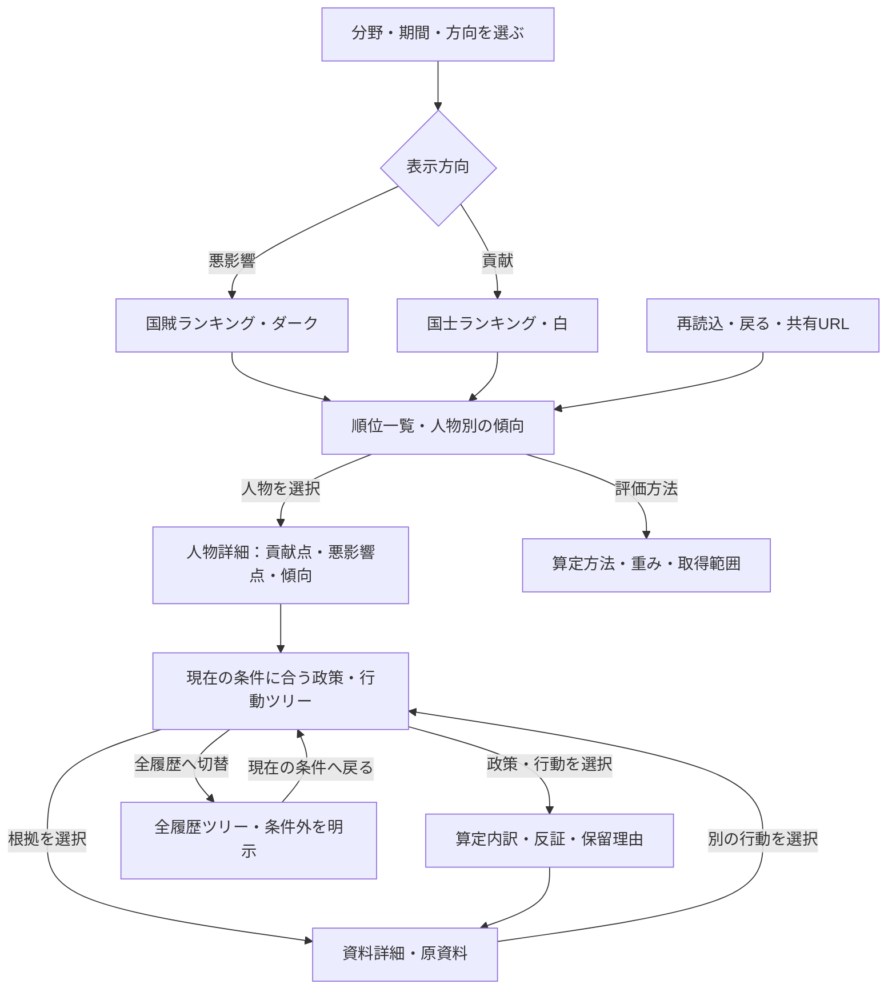

# 視覚表現と既存ツールの選定

本書は、この製品で何を視覚化するかの判断メモ。製品・評価方法の正本は [`PROJECT_SSOT.md`](../PROJECT_SSOT.md) と [`spec-card.md`](../spec-card.md)。動画やスライドの正本をこのリポジトリへ新設しない。

## 画面に採用する表現

初回の操作は「評価分野 → 比較期間 → 貢献／悪影響」の三つに絞る。順位を選んだ後で、人物の行動、政策、根拠へ進む。公約、総合重み、比較集団は詳細設定へ置く。画面の架空データ表示と実資料の保留表示を分離する。

2026-09-24の画面変更では、実資料のローカル確認欄をランキングより前から評価方法の後へ移した。順位を選択した後の人物詳細に「ランキングへ戻る」を追加し、比較条件を順位の近くで表示する。比較条件の変更は読み上げ対象の状態表示へ反映する。架空の順位と実資料の保留は別画面状態のまま維持する。

`Game Studio` の共通手順は、操作を始めやすくする、主操作と補助設定を分ける、パソコンとスマートフォンで試す、入力後の状態変化を確認する、という点に適用する。既存の`React`アプリはデータ比較であり、キャラクター・勝敗・進行ループを持つゲームではないため、`Phaser`や三次元エンジンを追加する根拠はない。これはプラグイン適合性の判断であり、製品をゲーム化する決定ではない。

画面の実装と検証は既存の`React`、`Build Web Apps`の画面確認、`frontend-design`の情報階層を使う。現行のブラウザ操作試験は条件切替、`URL`復元、行動別根拠、公式資料の保留表示、幅390ピクセルと1440ピクセルを確認する。画面遷移図が必要になれば既存の`Figma`資料を先に再読し、設計判断と根拠は本リポジトリに残す。

`Game Studio`のプレイテスト観点は「初回に主操作へ進めるか」「切替で状態が明確に変わるか」「詳細から元の比較に戻れるか」に限定して適用した。ブラウザ試験で小画面の表示順、キーボードでの切替と戻り、動きを減らす設定、横方向のはみ出し、パソコン表示を確認した。ゲーム固有のエンジン・素材・勝敗は適用しない。

## 2026-09-30の両面評価と条件連動ツリー

人物詳細の上部に貢献点・悪影響点・収録範囲の傾向を並べ、順位一覧にも同じ傾向を付けた。未評価は灰色で表示し、優勢を推定しない。ツリーには「現在の条件／全履歴」の切替を追加した。上の`Mermaid`図は、この表示切替と既存の資料導線を含む現行の遷移図。

## 2026-09-24の見た目の改訂（履歴）

利用者から、旧画面が汎用的な生成アプリの見た目に寄っているという指摘を受けた。根因は白い箱と薄緑の面を全セクションに繰り返し、見出し・本文・証拠の強弱が同質だったこと。既存の機能を保持し、書体・面・余白で次の階層へ直した。

| 部位 | 採用した表現 | 意図 |
|---|---|---|
| 導入部 | 濃い墨青の表紙、真鍮色の細い罫線、明朝体の大見出し | 公的記録を調べる道具としての固有性を出す |
| 比較面 | 生成カード風の影を外し、紙色と表の明確な横罫線を使う | 数値と未評価の差を最初に読めるようにする |
| 人物・資料 | 三列を個別カードではなく一続きの記録面として扱う | 行動→政策→根拠の関係を追いやすくする |
| 小画面 | 導入部の余白を縮め、記録面を縦につなぐ | 操作と行動の読みやすさを維持する |

色の正本は `app/src/styles.css` の変数。墨青 `#182b3b`、紙色 `#f4f0e7`、資料面 `#fffdf8`、強調の赤銅 `#a84232`、真鍮 `#c3914c` を使う。見出しは既存端末で使える明朝体、操作と本文はゴシック体。写真・生成画像・新しいアイコン素材は必要なく、画面構造をコードで表現する。

実装後の確認は既存のブラウザ操作試験8件、本番ビルド、画面幅1440・390ピクセルのスクリーンショット目視で実施した。順位→人物→資料と戻り、キーボード操作、動きを減らす設定、外部通信なしの架空画面は維持した。実資料の評価精度や公開時の見え方はこの視覚改訂の保証対象外。

### 表題と主順位の強弱を追加

利用者の「インパクトがなくなった」という指摘を受け、最初に目に入る表題の「国賊」だけを赤銅系の明るい色と大きい字形にし、残りの語は紙色で受ける。順位表は確認できる1位の行だけ墨青にして、順位と点数を大きく示す。未評価だけの条件や公約モードでは1位を強調しない。意味を持つ文字・数値へ強弱を集め、根拠欄の静かな書式は保つ。

分割した表題にも読み上げ名「国賊ランキング」を付けた。初回の画面試験で読み上げ名の変化を検出し、修正後にブラウザ操作試験8件、本番ビルド、幅1440・390ピクセルの画面を再確認した。

## 2026-09-29：三次元探索の試作設計（履歴）

利用者が選んだ「三次元探索中心・分析コンソール」に合わせ、以前の紙面型から暗い三列構成へ切り替える。以前の「三次元エンジンを追加する根拠はない」は2026-09-24時点の判断であり、今回の記録済み関係を操作して読む要件では置き換える。ゲーム化・勝敗・報酬は引き続き対象外。

| 部位 | 現行の設計 | 機能上の条件 |
|---|---|---|
| 上部 | 小さな製品名、分野・期間・方向、検索 | 全人物・政策・資料が架空であることを表示 |
| 左列 | 順位・評価点・人物選択 | 未評価を0点にしない |
| 中央 | 人物、政策、選択人物の行動と証拠 | 記録済み参照だけを結び、位置に思想や因果の意味を付けない |
| 右列 | 行動、政策、根拠の切替 | 同じ政策の提出と採決を区別し、点数は重複加算しない |
| 小画面 | 順位と詳細を先、三次元は明示操作 | 一覧でも同じ関係を選べる |

色は `app/src/styles.css` の変数を正本とし、暗い紺の背景 `#0b1420`、資料面 `#121f2d`、明るい本文、選択の琥珀色、悪影響の赤系、貢献の青緑を使う。文字と操作は`React`、形状と線はコードによる三次元表示。設計画像を操作画面として貼り付けない。

`React` 18を維持し、[既存の三次元関係図ライブラリ](https://github.com/vasturiano/react-force-graph)の `react-force-graph-3d` 1.29.1を直接依存として固定した。描画器を二重に導入せず、有限の配置、操作停止・非表示時の描画休止、`WebGL`障害時の一覧を用意する。正本データは描画器へ直接渡さず、 `app/src/exploration.ts` の派生コピーに限る。

設計画像との相違として、原資料の完全な名前・反証・算定条件を読めるように詳細列のスクロールを許す。小画面は三列を縮小せず縦に並べる。取得状況と評価方法は補助領域へ残し、`URL`復元・障害復旧は実画面の操作試験で別に確認する。

## 2026-09-30：`A`と`C`の組合せを採用

### 文体と操作の動き

画面側の説明・注意・空状態・読み取りエラーは、簡潔なです・ます調に揃えます。見出し・状態ラベル・ボタンは短く保ち、原資料の引用・資料名・評価記録は書き換えません。

色や枠は既存の`CSS`、詳細内容は既存の`GSAP`と`EvidenceMotion`へ集約します。ボタンは140ミリ秒、テーマは200ミリ秒、人物・行動・資料の選択は180ミリ秒（移動は最大3ピクセル）、選択対象を変えないタブ・履歴の切替は150ミリ秒、詳細設定の展開・収納は180ミリ秒です。同じ領域の二重演出、初回アニメーション、常時演出、点数のカウントアップは入れません。

連続操作は前の動きを終了して最後の状態へ収束します。動きを減らす設定は実行途中にも反映し、滑らかなスクロールも停止します。収納した設定は直ちに操作対象から外し、内部に残ったフォーカスを詳細設定ボタンへ戻します。算定・保存形式・公開設定は変更しません。

この変更のローカル検証では、単体58件、型検査を含む本番ビルド、依存監査（検出0件）、操作試験25件が成功しました。連続切替、設定収納時のフォーカス復帰、動きを減らす設定、両テーマの390・1440ピクセル表示を確認しています。独立レビューの指摘も回収し、既存の未コミット作業は維持しています。公開・外部反映・人間の体感レビューはこの検証に含みません。

比較した4案から、`A`の読みやすい一覧と`C`の二次元の関係図を採用した。悪影響は「国賊ランキング」・チャコール背景 `#151515`、貢献は「国士ランキング」・白背景 `#ffffff`。見出し・ブラウザタイトル・配色を選択方向から導出し、`URL`復元でも一致させる。色・文字・余白の正本は `app/src/styles.css`。

`PolicyFlow` が政策→個々の行動→その行動の資料を示す。政策影響の資料は別の行に置き、生成モックの同じ資料名を提出と採決へコピーしない。動きは `EvidenceMotion` の`GSAP` 3.15.0による短い選択フィードバックに限り、解除時に終了する。`Three.js`と三次元関係図の依存は現行アプリから外し、試作のコード・スタイル・試験は非公開のローカル保管へ退避した。

| 比較点 | 実装で確認した内容 |
|---|---|
| 表題・条件 | 国賊／国士、悪影響／貢献、期間・分野と`URL`の一致 |
| 配色 | 国賊はチャコール、国士は白。未評価は灰色の文字でも区別 |
| 配置 | `A`の順位一覧と`C`の政策・行動・資料の二列。小画面は縦に読む |
| 関係線 | 政策から提出・採決への分岐を接続し、各資料を個別に選択 |
| 文字 | 未評価の折返しを解消。大見出し、本文、資料名の階層を確認 |
| 操作 | 矢印・`Home`・`End`のタブ操作、動きを減らす設定、正常`JSON`保持 |

意図した差分は、モックの補作された党籍・政策説明を採用せず正本の記録だけを表示すること、未評価を無順位とすること、政策の影響資料と行動の資料を分けること。小画面では分岐の図形を縮小せず縦の一覧へ変える。算定の詳細と補助資料はスクロールして読める。

検証は単体37件、型検査・本番ビルド、依存監査0件、ブラウザ操作17件。設計原寸1536・1440・390ピクセル、両テーマの画像を目視比較した。ブラウザ用スキルの参照ファイルが取得できなかったため、既存`Playwright`の`Chromium`を使用した。内部ブラウザへの表示はアプリの既存入口へ依頼し、表示受付と実操作の検証を分けて記録した。未評価・保留と、同じ政策の重複算入の説明も区別した。

### 紹介用の動画・スライド候補（継続）

| 用途 | 候補と確認先 | 採用条件 |
|---|---|---|
| 画面や図解から短い説明動画 | [`HyperFrames`](https://github.com/heygen-com/hyperframes)／[`Remotion`](https://github.com/remotion-dev/remotion) | 公開用の台本・画面・権利を確認し、動画を作る依頼が具体化した時 |
| 実写の解説・操作動画を編集 | [`video-use`](https://github.com/browser-use/video-use) | 元映像があり、文字起こしや編集の作業が必要な時。導入・外部サービスの利用条件を別に確認 |
| 技術説明を版管理できるスライド | [`Slidev`](https://github.com/slidevjs/slidev) | 評価方法やデータフローを発表する時。内容は既存の設計正本から生成 |
| 編集可能な一般向け資料 | [`Presenton`](https://github.com/presenton/presenton) | 人間が後で編集する発表資料が必要な時。利用するモデルと資料の共有範囲を確認 |
| 手元の資料から説明案を作る | [`NotebookLM`のスライド・動画機能](https://blog.google/innovation-and-ai/products/notebooklm/notebooklm-google-io-2026/) | 外部への資料投入が許され、引用元を確認できる資料に限る |

候補の発見元は`Obsidian`の`GitHub`ツール目録、動画ツールの個別メモ、アイデア一覧。上記は2026-09-24の公式公開ページで機能を照合した候補であり、過去にユーザーが指したツール一式との完全一致は未確認。今回のローカル試作版では動画・スライドを生成していない。
