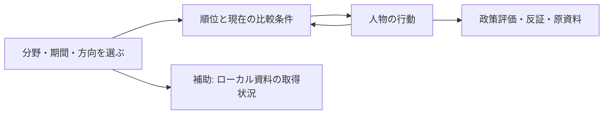

# 視覚表現と既存ツールの選定

本書は、この製品で何を視覚化するかの判断メモ。製品・評価方法の正本は [`PROJECT_SSOT.md`](../PROJECT_SSOT.md) と [`spec-card.md`](../spec-card.md)。動画やスライドの正本をこのリポジトリへ新設しない。

## 画面に採用する表現

初回の操作は「評価分野 → 比較期間 → 貢献／悪影響」の三つに絞る。順位を選んだ後で、人物の行動、政策、根拠へ進む。公約、総合重み、比較集団は詳細設定へ置く。画面の架空データ表示と実資料の保留表示を分離する。

2026-09-24の画面変更では、実資料のローカル確認欄をランキングより前から評価方法の後へ移した。順位を選択した後の人物詳細に「ランキングへ戻る」を追加し、比較条件を順位の近くで表示する。比較条件の変更は読み上げ対象の状態表示へ反映する。架空の順位と実資料の保留は別画面状態のまま維持する。

`Game Studio` の共通手順は、操作を始めやすくする、主操作と補助設定を分ける、パソコンとスマートフォンで試す、入力後の状態変化を確認する、という点に適用する。既存の`React`アプリはデータ比較であり、キャラクター・勝敗・進行ループを持つゲームではないため、`Phaser`や三次元エンジンを追加する根拠はない。これはプラグイン適合性の判断であり、製品をゲーム化する決定ではない。

画面の実装と検証は既存の`React`、`Build Web Apps`の画面確認、`frontend-design`の情報階層を使う。現行のブラウザ操作試験は条件切替、`URL`復元、行動別根拠、公式資料の保留表示、幅390ピクセルと1440ピクセルを確認する。画面遷移図が必要になれば既存の`Figma`資料を先に再読し、設計判断と根拠は本リポジトリに残す。

`Game Studio`のプレイテスト観点は「初回に主操作へ進めるか」「切替で状態が明確に変わるか」「詳細から元の比較に戻れるか」に限定して適用した。ブラウザ試験で小画面の表示順、キーボードでの切替と戻り、動きを減らす設定、横方向のはみ出し、パソコン表示を確認した。ゲーム固有のエンジン・素材・勝敗は適用しない。

## 2026-09-24の見た目の改訂

利用者から、旧画面が汎用的な生成アプリの見た目に寄っているという指摘を受けた。根因は白い箱と薄緑の面を全セクションに繰り返し、見出し・本文・証拠の強弱が同質だったこと。既存の機能を保持し、書体・面・余白で次の階層へ直した。

| 部位 | 採用した表現 | 意図 |
|---|---|---|
| 導入部 | 濃い墨青の表紙、真鍮色の細い罫線、明朝体の大見出し | 公的記録を調べる道具としての固有性を出す |
| 比較面 | 生成カード風の影を外し、紙色と表の明確な横罫線を使う | 数値と未評価の差を最初に読めるようにする |
| 人物・資料 | 三列を個別カードではなく一続きの記録面として扱う | 行動→政策→根拠の関係を追いやすくする |
| 小画面 | 導入部の余白を縮め、記録面を縦につなぐ | 操作と行動の読みやすさを維持する |

色の正本は `app/src/styles.css` の変数。墨青 `#182b3b`、紙色 `#f4f0e7`、資料面 `#fffdf8`、強調の赤銅 `#a84232`、真鍮 `#c3914c` を使う。見出しは既存端末で使える明朝体、操作と本文はゴシック体。写真・生成画像・新しいアイコン素材は必要なく、画面構造をコードで表現する。

実装後の確認は既存のブラウザ操作試験8件、本番ビルド、画面幅1440・390ピクセルのスクリーンショット目視で実施した。順位→人物→資料と戻り、キーボード操作、動きを減らす設定、外部通信なしの架空画面は維持した。実資料の評価精度や公開時の見え方はこの視覚改訂の保証対象外。

### 表題と主順位の強弱を追加

利用者の「インパクトがなくなった」という指摘を受け、最初に目に入る表題の「国賊」だけを赤銅系の明るい色と大きい字形にし、残りの語は紙色で受ける。順位表は確認できる1位の行だけ墨青にして、順位と点数を大きく示す。未評価だけの条件や公約モードでは1位を強調しない。意味を持つ文字・数値へ強弱を集め、根拠欄の静かな書式は保つ。

分割した表題にも読み上げ名「国賊ランキング」を付けた。初回の画面試験で読み上げ名の変化を検出し、修正後にブラウザ操作試験8件、本番ビルド、幅1440・390ピクセルの画面を再確認した。

## 紹介用の動画・スライド候補

| 用途 | 候補と確認先 | 採用条件 |
|---|---|---|
| 画面や図解から短い説明動画 | [`HyperFrames`](https://github.com/heygen-com/hyperframes)／[`Remotion`](https://github.com/remotion-dev/remotion) | 公開用の台本・画面・権利を確認し、動画を作る依頼が具体化した時 |
| 実写の解説・操作動画を編集 | [`video-use`](https://github.com/browser-use/video-use) | 元映像があり、文字起こしや編集の作業が必要な時。導入・外部サービスの利用条件を別に確認 |
| 技術説明を版管理できるスライド | [`Slidev`](https://github.com/slidevjs/slidev) | 評価方法やデータフローを発表する時。内容は既存の設計正本から生成 |
| 編集可能な一般向け資料 | [`Presenton`](https://github.com/presenton/presenton) | 人間が後で編集する発表資料が必要な時。利用するモデルと資料の共有範囲を確認 |
| 手元の資料から説明案を作る | [`NotebookLM`のスライド・動画機能](https://blog.google/innovation-and-ai/products/notebooklm/notebooklm-google-io-2026/) | 外部への資料投入が許され、引用元を確認できる資料に限る |

候補の発見元は`Obsidian`の`GitHub`ツール目録、動画ツールの個別メモ、アイデア一覧。上記は2026-09-24の公式公開ページで機能を照合した候補であり、過去にユーザーが指したツール一式との完全一致は未確認。今回のローカル試作版では動画・スライドを生成していない。
